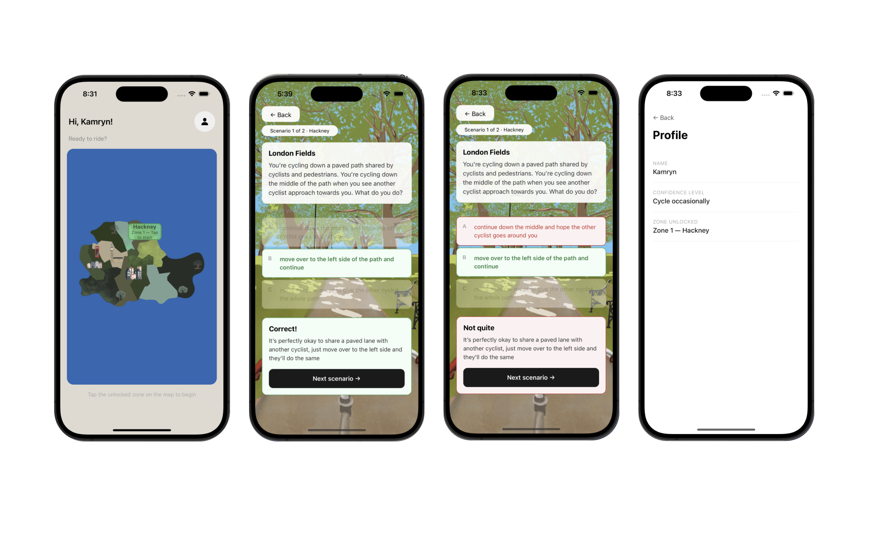

# London Cyclist — Demo App

 

## File structure

```
app/
  _layout.tsx          ← Expo Router stack navigator
  index.tsx            ← Home route (onboarding modal + home screen)
  scenario.tsx         ← Scenario route
  profile.tsx          ← Profile route

components/
  HomeScreen.tsx       ← Map + zone tap + profile nav
  OnboardingModal.tsx  ← First-launch name + confidence modal
  ScenarioScreen.tsx   ← Situation, options, feedback, back nav
  ProfileScreen.tsx    ← Displays saved profile info

hooks/
  useProfile.ts        ← Loads/saves profile via AsyncStorage
  useScenario.ts       ← Scenario state machine (answer, feedback, next)

data/
  scenarios.ts         ← 2 Hackney London Fields scenarios

types/
  index.ts             ← All shared TypeScript types

assets/
  images/
    london-map.png           
    london-fields-scene.png  
```

## Setup

Download the whole project to your computer
open in code editor

# Install dependencies
npx expo install @react-native-async-storage/async-storage
npx expo install expo-router


npx expo start
```


